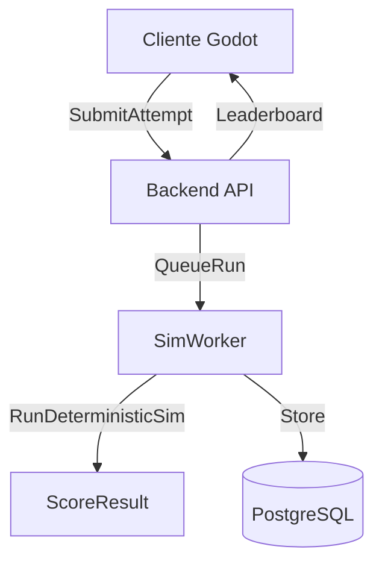

# RPG 2D (Godot) + Lua scripting + Rankings autoritativos

## Objetivo y pilares
- **Juego**: RPG 2D top-down single-player, movimiento por **tiles** y combate por **ticks**.
- **Aprendizaje**: el jugador progresa programando (Lua) con una API del juego que se desbloquea por misiones/level.
- **Competencia**: rankings asíncronos **seguros**; el servidor **re-ejecuta/simula** el reto para generar el score.
- **Accesibilidad**: jugar manual (WASD/joystick) o automatizado (Lua). Jugadores avanzados pueden “saltar tutorial” sin romper el balance.

## Stack propuesto
- **Cliente**: Godot 4.x
  - Lógica del juego: GDScript (rápida iteración).
  - Input: teclado + joystick móvil.
  - Assets: Mundo **Mixel 32×32** + ítems **DB32 16×16 CC0** escalados ×2 en UI.
- **Scripting del jugador**: **Lua** embebido
  - Sandbox estricto (solo API white-list).
  - Determinismo para servidor: sin tiempo real del sistema, sin RNG libre, sin I/O.
- **Servidor (autoritativo para retos/ranking)**: 1 servicio HTTP + 1 worker de simulación
  - Lenguaje elegido: **Node.js**.
  - Convenciones sugeridas:
    - TypeScript en backend.
    - API versionada: `/v1/...`
    - 2 procesos: `api` (HTTP) + `sim-worker` (simulación y ranking).
  - DB: **PostgreSQL**.
  - Cache/colas: opcional (Redis) si crece.

## Diseño de juego (core loop)
- **Explorar/farmear** en mapas, matar monstruos, recoger loot, vender/comprar, subir nivel/skills.
- **Manual**: el jugador controla al personaje.
- **Auto (Lua)**: el jugador escribe scripts que toman decisiones (mover, atacar, loot, usar poción, vender, etc.) respetando limitaciones.

## Sistema de ticks (base técnica)
- **Tickrate fijo: 10 ticks/seg** (1 tick = 100 ms).
- Todo lo “importante” (movimiento, ataques, cooldowns, uso de ítems) avanza por tick.
- **Movimiento por tiles: discreto** (1 `move(dir)` = 1 tile). Coste inicial: **1 tick por tile**.\n+- Presupuesto de script por tick:\n+  - **máximo 1 acción mayor por tick** (mover / atacar / habilidad / usar ítem / loot / buy/sell).\n+  - getters/lecturas no consumen acción.\n+  - watchdog: límite de instrucciones/tiempo CPU (parámetro de balance).

## Profesiones y progresión
- **Clases**: Guerrero / Mago / Arquero.
- **Stats por uso** (inspiración Tibia): el skill principal sube por “acciones válidas” realizadas:
  - Guerrero: `meleeSkill`
  - Arquero: `rangedSkill`
  - Mago: `magicSkill`
- **Daño**: función del skill + arma + nivel + defensas del objetivo.
- **Habilidades únicas** por clase:
  - Guerrero: gap-closer / stun corto / taunt PvE.
  - Arquero: multi-shot / kite tool.
  - Mago: bolt / AoE pequeño / shield mana.
- **Rango configurable** para mago/arquero: en el bot el jugador define `desiredRange` (p.ej. 1–6 tiles) y el pathing ajusta.

### Fórmulas de skills (documentar y parametrizar)
- Adoptar una fórmula tipo Tibia como referencia, pero dejarla **parametrizable** en data.
- Propuesta mínima (determinista, fácil de balancear):
  - `skillXp += baseXpPerUse * monsterFactor * hitFactor`
  - `skillLevelUpXp = a * (b ^ skillLevel)`
  - `damage = (weaponBase + weaponScale*skill) * classMultiplier * (1 + level/100) - targetDefense`
- Mantener todo en una tabla de configuración (JSON/YAML) para poder ajustar sin tocar código.

### Regla anti-farming de skill (cerrada)
- Los skills ganan XP por **intentos** (acciones de ataque/cast que consumen un swing/shot/cast), pero:
  - Si hay **N intentos seguidos sin hit**, deja de otorgar skill XP hasta que ocurra **1 hit**.
  - Ventana elegida: **global** (aplica a cualquier objetivo).
  - Valor inicial propuesto: **N = 10** (parametrizable).
- Además existe **nivel de personaje** (XP por kills/quests) además de skill.

## Ítems y economía
- Slots: arma, escudo, casco, armadura, botas.
- Stats iniciales: solo `attack` y `defense` (+ requisitos de nivel).
- Loot: oro + equipo + consumibles (pociones).
- Tienda: vender loot / comprar pociones.
- Inventario: peso/capacidad (cap) que escala con nivel o con equipo.

## Contenido: tutorial vs jugadores avanzados
- **Ruta tutorial** (misiones guiadas) que desbloquea API Lua por etapas.
- **Ruta avanzada**: “modo libre” desde inicio con API más amplia, pero:
  - retos/rankings usan “ligas” o “restricciones por capítulo” para no mezclar principiantes con avanzados.
  - o bien un sistema de “perfil” donde el jugador elige: `BeginnerTrack` vs `FreeTrack`.

## API Lua (sandbox) por niveles
Modelo elegido: **acciones directas** (el script decide cada tick).\n+\n+Lecturas (no consumen acción):\n+- `getTick()`\n+- `getPosition()`\n+- `getHp()`, `getMana()`, `getMaxHp()`, `getMaxMana()`\n+- `getLevel()`, `getClass()`, `getSkills()`\n+- `getCapacity()`, `getCarryWeight()`\n+- `getInventory()`\n+- `nearestEnemy(maxRange)`, `nearestLoot(maxRange)`\n+- `isTileWalkable(x,y)`, `distanceTo(x,y)`\n+\n+Acciones (máx 1 por tick):\n+- `move(dir)` (N/S/E/W)\n+- `moveTo(x,y)` (**A\\*** completo; falla si no hay path)\n+- `attack(entityId)` (rango: **solo rango, sin LoS**)\n+- `usePotion(typeOrItemId)`\n+- `loot()`\n+- `equip(itemId)`, `unequip(slot)`\n+- `buy(itemId, qty)`, `sell(itemId, qty)` (solo en shop)\n+\n+Configuración:\n+- `setDesiredRange(n)` (para mago/arquero)

### Reglas del sandbox
- No acceso a `os`, `io`, filesystem, red.
- RNG solo vía `game.random()` con seed controlada por el motor (para reproducibilidad en servidor).
- Cotas: memoria, tamaño del script, instrucciones por tick.
- Prohibir loops infinitos: watchdog + contador de instrucciones.

## Rankings: retos autoritativos por simulación
- Concepto: el ranking se calcula en **instancias de reto** con:
  - **mapa identificado** (`map_id` + `map_version`; cada mundo futuro tendrá town + NPCs propios).
  - mapa fijo + seed
  - **ventana de tiempo fija** (ej. farm de **5 min** = `durationTicks`; con 10 TPS → **3000 ticks**).
  - ligas paralelas (**build fijo vs personaje propio**; ver más abajo).
  - métricas múltiples por mapa (**varios tops** por la misma simulación o por misma entrada de script según cómo registres métricas).
  - reglas y API Lua restringidas según temporada/liga si hace falta.

### Flujo


- El cliente envía: `challengeId` (o `map_challenge_id`), `script`, `buildVersion`, `bracket` (`standard` \| `open`), `metadata`.
- El servidor:
  - valida tamaño/versión
  - compila/carga Lua en sandbox
  - simula el reto con tick engine determinista
  - produce `score` (oro, tiempo, muertes, daño recibido, etc.)
  - guarda replay/seed para auditoría (opcional)

### Anti-trampa
- Score nunca viene del cliente.
- Firma/versión: el reto está versionado; si cambia, se crea `challengeVersion`.
- Limitar API y determinismo.

### Rankings por mapa + múltiples tops (idea adoptada)

Cada **`map_id`** tiene su propio conjunto de tablas/clasificación. Cuando existan más mapas (cada uno con su town y NPCs), el jugador elegirá reto desde ese mapa; el backend versiona por `map_version` igual que cualquier cambio de spawns/spots.

#### Ventana temporal fija (“5 minutos”)
- `durationTicks` = **3000** (si 10 TPS → 300 s ≈ **5 min**). Parametrizable por reto/map_version.

#### Dos ligas (siempre paralelas por mapa y ventana de simulación)
| Liga | Identificador | Qué estado usa el servidor al simular |
| --- | --- | --- |
| **Standard (igualdad)** | `bracket_standard` | **Build fijo** definido por el reto: misma clase o elección dentro de whitelist, mismo **level**, mismo **skills snapshot**, mismo **equipment + inventario inicial** para todos. Diseñado para comparar scripts y automatización sin ventaja por grind. |
| **Open (progresión real)** | `bracket_open` | **Copia autoritativa** del personaje del jugador (nivel/skills/inventario/gear) válida en ese momento (`player_snapshot`), sujeta a reglas anti-cheat del backend. Diseñado para “mi build optimizado”. |

- En **Standard**, el cliente **no** envía stats; solo `script`, `challenge_version`, `bracket=standard`.
- En **Open**, el cliente puede enviar un **hash opcional** de snapshot para chequeo; la simulación usa el snapshot persistido/registrado en el servidor (no confiar solo en cliente).

#### Múltiples leaderboards por mapa (métricas)
Un mismo intent de simulación de **5 min** puede extraer todas las métricas; cada una define un **leaderboard vertical** opcional:

| `metric_kind` | Criterio de orden (principal) | Notas |
| --- | --- | --- |
| `gold_farmed` | Máximo `gold_delta` durante la ventana | Oro neto dentro del Sandbox del reto (no economía persistente hasta que decidáis rewards). |
| `damage_done` | Máximo daño infligido (`damage_dealt_total`) | Incluye DPS práctico de script + build. |
| `monsters_killed` | Máximo número de kills | Empates habituales; definir tie-break. |

Puedes añadir después: `experience_gained`, `potions_efficiency`, `script_actions_minimal`, etc.

#### Desempates sugeridos (por métrica)
- **`gold_farmed`**: mayor oro delta → menor `potions_used` → menor `damage_taken` → menor `elapsed_ticks_used` dentro de ventana si aplica → `attempt_at` anterior.
- **`damage_done`**: mayor damage → menor muertes del jugador → mismo resto que arriba.
- **`monsters_killed`**: mayor kills → mayor daño residual o tiempo restante hasta fin de ventana → mismos criterios.

#### Ejemplo MVP (un solo mapa)
- **`map_id`**: `world_01` — Riverton/Greenfield/Outskirts.
- Una `challenge_version` por temporada de balance (= mismos spawns preset + mismo `durationTicks`).
- **6 boards** mínimos (3 métricas × 2 brackets), por ejemplo IDs lógicos:
  - `lb_world_01_gold_standard`, `lb_world_01_gold_open`
  - `lb_world_01_damage_standard`, `lb_world_01_damage_open`
  - `lb_world_01_kills_standard`, `lb_world_01_kills_open`

#### Retos adicionales (opcional): objetivo puntual vs farm
Seguimos pudiendo ofrecer aparte un Challenge tipo **“completar ruta objetivo rápido”** (tipo carrera) dentro del mismo mapa; no sustituye a los rankings de farm de 5 min, convive como `challenge_kind` distinto (`speedrun` vs `farm_window`).

#### Anti-trampa específicos (mapa + multiboard)
- **Semilla determinista** + spawns reproducibles por `map_version`.
- **Standard**: imposibilita llevar equipo “externo”; solo existe el preset del servidor.
- **Open**: validar snapshot contra reglas (ítems válidos para mapa/nivel máximo si queréis caps por temporada).
- **Sin inflar economía mundial**: recompensa de ranking opcional cosméticos o temporada, no dumps de oro persistente sin revisión.

### Legacy: Challenge “v1 ruta objetivo balanceada” (referencia)
Opcional dentro de `world_01` como segundo `challenge_kind`: completar objetivo con **score compuesto** (tiempo + oro + penalizaciones); los rankings por métricas de 5 min no dependen de este diseño pero pueden reutilizar el mismo motor de simulación.

## Backend (MVP): cuentas + cloud save + ranking
- **Auth**: email/password o OAuth (Google/Apple) dependiendo plataforma.
- **Cloud save**:
  - guardar progreso (nivel, skills, inventario, oro) como estado validado.
  - el backend debe validar coherencia básica (no teleports, no items imposibles).
  - alternativa: progreso local y solo ranking autoritativo; pero el usuario pidió cloud save en MVP.

### Modelo de datos (alto nivel)
- `users`
- `player_profiles` (clase, nivel, skills)
- `inventories` / `items_owned`
- `challenges` / `challenge_versions`
- `challenge_attempts` (script hash, score, createdAt)

### Endpoints (propuesta mínima)
- `POST /v1/auth/register`
- `POST /v1/auth/login`
- `GET /v1/profile/me`
- `PUT /v1/profile/me` (clase, preferencias)
- `GET /v1/save`
- `PUT /v1/save` (cloud save)
- `GET /v1/challenges` (lista + versiones)
- `POST /v1/challenges/:id/attempts` (subir script)
- `GET /v1/challenges/:id/leaderboard` (top N)
- `GET /v1/challenges/:id/attempts/mine` (historial personal)

### Esquema DB (mínimo)
- `users(id, email, password_hash, created_at)`
- `player_profiles(user_id, class, level, skills_json, gold, created_at, updated_at)`
- `player_inventory(user_id, items_json, carry_weight, capacity, updated_at)`
- `player_save(user_id, save_json, save_version, updated_at)`
- `challenges(id, name, description_key, active)`
- `challenge_versions(id, challenge_id, version, seed, map_id, rules_json, api_level, duration_ticks, created_at)`
- `challenge_attempts(id, user_id, challenge_version_id, script_text, script_hash, status, score_json, created_at, finished_at)`
- `leaderboard_entries(challenge_version_id, user_id, best_score_json, best_rank, updated_at)`

### Worker de simulación
- Proceso separado (`sim-worker`) que toma `challenge_attempts.status='queued'`.
- Ejecuta la simulación determinista (tick engine + Lua sandbox).
- Escribe `score_json`, marca `status='completed'`.
- Actualiza `leaderboard_entries`.

## i18n (ES/EN)
- Todas las strings en archivos de traducción desde el día 1.
- Estandarizar keys (`ui.play`, `quest.tutorial.move.title`, etc.).
- Evitar texto hardcodeado en scripts.

Alcance mínimo en MVP:
- UI (menús, inventario, tienda, editor).
- Objetivos de misiones/tutorial.
- Errores del runtime Lua (parse/runtime) normalizados a mensajes amigables (`lua.error.syntax`, `lua.error.runtime`).

## UX: editor de código
- Editor integrado (tipo IDE) con:
  - botón Run/Stop
  - consola de errores Lua (línea/columna)
  - plantillas por misión
  - modo “manual override” (si el script falla, el jugador puede retomar control)

## Roadmap por fases
- Fase 0: vertical slice local
  - movimiento por tiles + ticks
  - 1 mapa exterior
  - combate básico + loot + tienda
  - editor Lua con API nivel 1–2
- Fase 1: progreso + clases
  - clases, skills por uso, habilidades
  - equipo con atk/def + requisitos
  - misiones tutorial + modo libre
- Fase 2: backend MVP
  - auth + cloud save
  - challenge system + sim server + leaderboard
- Fase 3: pulido
  - balance, UX editor, logs/replays, ligas
  - ads + remove-ads (móvil), demo (Steam)

## Assets (documentado)
- Mundo: Mixel 32×32.
- Ítems: `16x16 RPG Items (DB32)` (CC0) escalado ×2 para UI: https://opengameart.org/content/16x16-rpg-items-db32

## Alcance MVP (cerrado y detallado)

### Tamaño y meta del MVP
- **MVP pequeño**: un único `World_01` reproducible (tiles 32×32, 10 TPS) con **tres zonas lógicas** (mismo archivo de mapa o sub-áreas conectadas por transición simple).
- **Salida del MVP**: jugador puede crear personaje (3 clases), completar tutorial (~8–10 misiones), farmear básico indefinidamente, comprar/vender, equipar, y **correr scripts Lua** que usan la API desbloqueada. Rankings + cloud save entran en **Fase 2** (el MVP de contenido debe poder jugarse **offline** primero).

### Estructura del mundo (1 escena / 1 mapa)
- **Greenfield (exterior)**: hierba, algunos árboles, 1–2 spots de spawn de bichos, 1 “área de práctica” acotada por vallas o rocas (para misiones sin perderse).
- **Riverton (pueblo)**: NPC comerciante (`shop`), tablón de misiones opcional, punto de guardado o “campfire” (si aplica más adelante).
- **Outskirts (peligro ligero)**: transición visual hacia un claro con más spawns; mismo mapa, zona más al este/sur.

IDs de tile y decoración: packs acordados (**Mixel** mundo, **DB32** solo iconos UI/loot).

### Clases al inicio del juego
- Elegir profesión **Guerrero / Mago / Arquero** al crear perfil (nombre + clase).
- Equipo inicial mínimo ya asignado según clase (ver tabla de ítems).

### Monstruos (3 tipos) — roles de diseño
| id | Nombre (placeholder) | Rol en tutorial | Loot base |
| --- | --- | --- | --- |
| `mob_slime` | Babosa / slime | Primer combate, muy fácil, enseña loot | poco oro, pocas veces “chatarra” vendible |
| `mob_wolf` | Lobo | DPS + movimiento, enseña kiting básico (`setDesiredRange`) | oro medio, posible drop de piel (vendible) |
| `mob_bandit` | Bandido | Mini “élite”, más HP, enseña uso de poción/mana | mejor oro, posible drop arma/armor tier 1 |

Stats concretos (HP, daño, XP) quedan **parametrizadas** en JSON; el MVP solo necesita que las relaciones sean **slime < wolf < bandit**.

### Equipamiento MVP (8 piezas = 6–10 rango alto del plan)
Todos con solo `attack` y/o `defense` (+ `levelReq` donde aplique). Iconos desde **DB32** (mapear sprite por `itemId`).

| itemId | Nombre placeholder | Slot | Clase objetivo | Notas |
| --- | --- | --- | --- | --- |
| `wpn_rust_sword` | Espada oxidada | weapon | Warrior | inicial warrior |
| `wpn_weak_staff` | Bastón viejo | weapon | Mage | inicial mage |
| `wpn_short_bow` | Arco corto | weapon | Archer | inicial archer |
| `arm_cloth_tunic` | Túnica simple | armor | todas | inicial todas |
| `shld_wood_round` | Escudo redondo | shield | Warrior (principal) | inicial warrior; otros pueden no equipar hasta tutorial |
| `helm_leather_cap` | Gorro de cuero | helmet | todas | opcional quest o tienda tier 1 |
| `boots_worn` | Botas gastadas | boots | todas | opcional loot lobo/tienda |
| `acc_none_placeholder` | (ninguno en MVP si hace falta recortar) | — | — | Si priorizamos 8 piezas, **no hay anillo/amuleto** en MVP |

Equipar y soltar debe actualizar capacidad/`attack`/`defense`. Sin gemas/enchants.

### Consumibles y economía MVP
- **Poción vida** (`pot_hp_small`): comprable en tienda, usable con `usePotion` y manual.
- **Poción mana** (`pot_mp_small`): idem para mago/archer especialmente.
- **Oro**: moneda única (stack en inventario UI o campo `gold` en perfil).

**Riverton Trader (shop)**:
- compra: `pot_hp_small`, `pot_mp_small` (opcional 1 arma “upgrade” muy barata más adelante — **fuera del MVP si complica balance**).
- venta: cualquier loot con `sellPrice`.

### Misiones tutorial (10 propuestas) + desbloqueo de API Lua
Orden recomendado; cada misión debe tener **plantilla de script** embebida y texto i18n `quest.<id>.title/description`.

Progresión pedagógica obligatoria en primeras misiones (estilo curso real):
- Misión temprana de **variables** (`local steps = 4`, `local hp = getHp()`).
- Misión temprana de **condicionales** (`if/else`) para decidir acción simple.
- Misión temprana de **ciclos** (`for` o `while`) con límite de iteraciones.
- Misión temprana de **funciones** (`function go_to_shop() ... end`) para reutilización.
- El texto de misión debe explicar el concepto en lenguaje de aprendizaje, no solo “cumple objetivo”.

| # | Misión ID | Manual / Script | Objetivo | API desbloqueada al completar |
| --- | --- | --- | --- | --- |
| 1 | `quest_welcome_manual` | Manual | Hablar con el NPC guía / llegar al cartel del pueblo | — (intro UI) |
| 2 | `quest_variables_state` | Script | Crear variables con estado del jugador (`hp`, `mana`, `x`, `y`) y usarlas en consola/mensaje | lecturas base: `getTick`, `getPosition`, `getHp`, `getMana` |
| 3 | `quest_if_safe_or_heal` | Script | Usar `if/else`: si HP < X usar poción dummy, si no moverse a punto seguro | `move(dir)`, `usePotion` (modo tutorial/simulado) |
| 4 | `quest_loop_patrol` | Script | Usar ciclo (`for`/`while`) para patrullar una ruta corta de tiles sin salir del área | validación de loops + `move(dir)` |
| 5 | `quest_function_move_to_flag` | Script | Declarar y llamar una función (`go_to_flag`) que combine `moveTo` y checks básicos | `moveTo`, `isTileWalkable` |
| 6 | `quest_inventory_caps` | Script | Loot X ítems y verificar peso/`getInventory` antes de poder entregar | `getInventory`, `getCapacity`, `getCarryWeight` |
| 7 | `quest_kite_wolf` | Script | Derrotar lobo usando `setDesiredRange` ≥ 2 (clase ranged) **o** misión paralela melee | `setDesiredRange` |
| 8 | `quest_use_potions` | Script | Quedarte por debajo de Y% HP, usar `usePotion`, ganar encuentro siguiente | `usePotion` |
| 9 | `quest_shop_loop` | Script | Vende Y piezas de chatarra, compra Z pociones, vuelve a NPC | `buy`, `sell` |
| 10 | `quest_bandit_mini` | Script + farm | Mata al bandido (o grupo pequeño) y entrega objeto de misión — **primer “capítulo cerrado”** | `equip` / `unequip` (si no antes) |

**Modo jugador que ya programa**: opción menú **“Saltar tutorial”** que marca misiones 2–10 como completadas solo en **progresión local**, desbloquea **toda la API MVP** abreviadas, pero el jugador nuevo sigue por orden (evita spoilers pedagógicos).

### Plantillas y validación didáctica (misiones 2–5)
Cada misión debe incluir:
- plantilla inicial con TODOs;
- botón “probar”;
- veredicto con checks automáticos;
- explicación corta de por qué falló.

#### Misión 2: Variables (`quest_variables_state`)
Plantilla sugerida:
```lua
-- Objetivo: guardar estado en variables y mostrarlo
local hp = getHp()
local mana = getMana()
local pos = getPosition()

-- TODO: crea variable x y y usando pos
-- TODO: imprime (o retorna) un texto con hp, mana, x, y
```
Checks de éxito:
- se declaran variables `hp` y `mana`;
- se usa `getPosition()` y se accede a coordenadas;
- el script ejecuta sin error y produce salida.
Errores comunes detectables:
- `attempt to index a nil value` por `pos`;
- typo en nombres (`healt`, `maná`);
- no usar variables (hardcode).

#### Misión 3: Condicionales (`quest_if_safe_or_heal`)
Plantilla sugerida:
```lua
local hp = getHp()
local threshold = 50

if hp < threshold then
  -- TODO: usar poción
else
  -- TODO: moverte 1 tile al norte
end
```
Checks de éxito:
- existe bloque `if/else`;
- hay una acción distinta en cada rama;
- al simular HP bajo y alto, ambas ramas funcionan.
Errores comunes detectables:
- usar `=` en vez de comparación;
- comparar con variable no definida;
- ramas vacías.

#### Misión 4: Ciclos (`quest_loop_patrol`)
Plantilla sugerida:
```lua
-- Patrulla simple: 2 pasos norte, 2 sur
for i = 1, 2 do
  move("N")
end

for i = 1, 2 do
  move("S")
end
```
Checks de éxito:
- hay al menos un ciclo (`for` o `while`);
- número de acciones dentro de límite de seguridad;
- termina dentro de timeout y vuelve a tile esperado.
Errores comunes detectables:
- loop infinito (`while true do ... end`);
- dirección inválida;
- exceder presupuesto por tick.

#### Misión 5: Funciones (`quest_function_move_to_flag`)
Plantilla sugerida:
```lua
function goToFlag(x, y)
  return moveTo(x, y)
end

-- TODO: llamar función con coordenadas de bandera
goToFlag(12, 8)
```
Checks de éxito:
- existe definición `function ... end`;
- la función se invoca al menos una vez;
- llega a la bandera (o retorna fallo de path controlado).
Errores comunes detectables:
- definir función pero no llamarla;
- parámetros invertidos;
- no manejar retorno de `moveTo`.

### Motor de feedback educativo (MVP)
- Mapear errores Lua a mensajes i18n amigables:
  - `lua.error.syntax.unexpected_symbol`
  - `lua.error.runtime.nil_index`
  - `lua.error.runtime.timeout_loop`
  - `lua.error.validation.missing_if`
  - `lua.error.validation.missing_loop`
- Cada misión debe mostrar:
  - “Qué faltó”
  - “Ejemplo mínimo correcto”
  - “Pista siguiente intento”

### Challenges / rankings en MVP de contenido
- **Opcional dentro del mismo build**: `challenge_offline_dummy` ejecutado solo en cliente (score local) como práctica antes del backend.
- **Online ranking**: primera `challenge_version` real cuando exista worker + DB (no bloquea cierre del MVP de juego offline).

### Criterios de “MVP contenido terminado”
- Flujo nuevo jugador + flujo saltar-tutorial sin softlocks.
- 3 MOBs con loot y balance mínimo.
- tienda estable (buy/sell) con reglas servidor **o validación cliente** sólo offline hasta backend.
- editor Lua ejecuta/consola errores/traducción keys mínimas.

### Parametrización (todo en datos, no hardcode disperso)
- `data/mvp/monsters.json`, `data/mvp/items.json`, `data/mvp/quests.json`, `data/mvp/shop.json`, `data/mvp/spawns.json`.

---

## Documentación en GitHub ([rpglearndev](https://github.com/rpglearndev))

### Estructura de repositorios (recomendada, monorepo)
- **Repo:** `rpglearndev/rpglearn` (privado o público según prefieras).
- **Rutas:**
  - `docs/plan.md` — copia de este plan (fuente de verdad de diseño).
  - `docs/backlog.md` — user stories listas para copiar a Issues (ver sección siguiente).
  - `client/godot/` — Godot 4.
  - `server/` — Node.js TypeScript (`api` + `sim-worker`).
  - `data/mvp/` — JSON de balance/contenido.
  - `assets/` — Mixel + DB32 + `CREDITS.md`.
- **Labels sugeridos:** `epic/*`, `phase-0`, `phase-1`, `phase-2`, `area/client`, `area/server`, `area/content`, `priority/p0|p1`.
- **GitHub Project:** tablero *MVP Roadmap* con columnas `Backlog` → `Ready` → `In Progress` → `Review` → `Done`.
- **Convención de Issues:** título `US-### — resumen corto`; enlace al Epic en descripción.

### Comandos `gh` (cuando ejecutes, no en plan mode)
```bash
gh repo create rpglearndev/rpglearn --private --description "RPG 2D learn-to-code (Godot + Lua)"
gh project create --owner rpglearndev --title "MVP Roadmap"
# Copiar docs/plan.md y crear Issues desde docs/backlog.md
```

---

## Backlog — User Stories (formato GitHub)

Cada ítem abajo es una **Issue** lista para pegar. IDs: `US-001` …

---

### Epic E00 — Repositorio, documentación y convenciones

#### US-001 — Inicializar monorepo y documentación
*Como* desarrollador del proyecto,
*quiero* un repositorio en la org `rpglearndev` con estructura de carpetas y `docs/plan.md`,
*para* tener una base versionada antes de escribir código de juego.

**Descripción:**
Crear repo `rpglearn`, README mínimo, `.gitignore` (Godot, Node, env), subir `plan.md` y `backlog.md`, definir licencia del código propio y `CREDITS.md` para assets (Mixel, DB32 CC0).

**Criterios de aceptación:**
1. Repo accesible en `github.com/rpglearndev/rpglearn` (o nombre acordado).
2. Existe `docs/plan.md` alineado con este documento.
3. README explica cómo abrir cliente Godot y (futuro) servidor.
4. `CREDITS.md` lista fuentes de assets y licencias.

**Dependencias:** ninguna.

**Notas:** org ya creada; sin repos públicos aún.

---

#### US-002 — GitHub Project y plantilla de Issue
*Como* desarrollador,
*quiero* un Project board y plantilla de Issue con secciones Como/Quiero/Para y criterios,
*para* gestionar el MVP sin perder el formato de historias.

**Criterios de aceptación:**
1. Project *MVP Roadmap* con columnas definidas.
2. Plantilla `.github/ISSUE_TEMPLATE/user_story.md` (opcional feature request).
3. Labels `epic/*`, `phase-*`, `area/*` creados.

**Dependencias:** US-001.

---

### Epic E01 — Motor de ticks y movimiento (Fase 0)

#### US-010 — Tick engine determinista (10 TPS)
*Como* jugador (y simulador futuro),
*quiero* que el mundo avance en ticks fijos de 100 ms,
*para* que combate, movimiento y scripts sean predecibles y reproducibles.

**Descripción:**
Implementar `TickWorld` en cliente: contador global, cola de acciones, 1 acción mayor por tick, coste 1 tick por tile al mover.

**Criterios de aceptación:**
1. Tickrate configurable; default 10 TPS.
2. Movimiento discreto N/S/E/W consume 1 tick y mueve 1 tile si es walkable.
3. Tests unitarios o escena debug muestran mismo resultado con misma secuencia de inputs.
4. Sin dependencia de `delta` real para lógica de juego.

**Dependencias:** US-001, proyecto Godot base.

**Notas:** base para ranking servidor.

---

#### US-011 — Input manual WASD y joystick
*Como* jugador,
*quiero* controlar al personaje con teclado o joystick además del bot Lua,
*para* aprender manualmente y retomar control si el script falla.

**Criterios de aceptación:**
1. WASD mueve 1 tile por pulsación (o por tick según diseño acordado).
2. Joystick virtual en móvil (stub o implementación mínima en desktop).
3. Modo manual anula acciones del script en el mismo tick (prioridad manual).

**Dependencias:** US-010.

---

#### US-012 — Mapa World_01 con TileMap 32×32
*Como* jugador,
*quiero* un mapa con Greenfield, Riverton y Outskirts,
*para* explorar, farmear y hacer misiones tutorial.

**Criterios de aceptación:**
1. TileMap 32×32 con assets Mixel; filtro Nearest.
2. Zonas lógicas identificadas (metadata o layers).
3. Área de práctica acotada para misiones de código.
4. Y-sort en capa de entidades.

**Dependencias:** US-001, assets Mixel importados.

---

### Epic E02 — Combate, loot y economía básica (Fase 0)

#### US-020 — Combate melee y ranged por ticks
*Como* jugador,
*quiero* atacar enemigos respetando cooldown y rango (sin LoS),
*para* farmear y completar misiones de combate.

**Criterios de aceptación:**
1. `attack` valida rango; mago/arquero usan `setDesiredRange`.
2. Daño usa fórmula parametrizada (JSON).
3. Enemigo puede morir; XP/oro según `monsters.json`.

**Dependencias:** US-010, US-030 (datos monstruos).

---

#### US-021 — Tres monstruos MVP y spawns
*Como* jugador,
*quiero* slime, lobo y bandido con dificultad creciente,
*para* progresión de combate y tutorial.

**Criterios de aceptación:**
1. `mob_slime`, `mob_wolf`, `mob_bandit` en `data/mvp/monsters.json` + spawns.
2. Relación de poder: slime < wolf < bandit.
3. Drops básicos (oro, chatarra vendible).

**Dependencias:** US-012.

---

#### US-022 — Loot, inventario y capacidad
*Como* jugador,
*quiero* recoger loot y ver peso/capacidad,
*para* gestionar farm y misiones de inventario.

**Criterios de aceptación:**
1. `loot()` en tile actual añade ítems/oro.
2. `getInventory`, `getCapacity`, `getCarryWeight` reflejan estado real.
3. No se puede recoger si excede capacidad.

**Dependencias:** US-020, ítems DB32 mapeados.

---

#### US-023 — Tienda Riverton (buy/sell)
*Como* jugador,
*quiero* vender loot y comprar pociones en el pueblo,
*para* economía loop y misión de tienda.

**Criterios de aceptación:**
1. NPC shop en Riverton; UI o interacción por tile.
2. `buy`/`sell` vía Lua y manual (misma lógica).
3. Precios en `data/mvp/shop.json`.

**Dependencias:** US-022, US-012.

---

### Epic E03 — Lua sandbox y editor (Fase 0–1)

#### US-030 — Runtime Lua embebido con sandbox
*Como* jugador que aprende a programar,
*quiero* ejecutar scripts Lua con API limitada del juego,
*para* automatizar acciones sin riesgos de seguridad.

**Descripción:**
Integrar Lua en Godot; bloquear `os`, `io`, red; whitelist de funciones; watchdog de instrucciones; 1 acción mayor/tick.

**Criterios de aceptación:**
1. Script corre en sandbox; errores capturados con línea.
2. API MVP expuesta según desbloqueos de misión.
3. `moveTo` usa A* completo; falla controlado sin path.
4. RNG solo vía API del motor con seed fija en modo reto.

**Dependencias:** US-010.

---

#### US-031 — Editor de código in-game
*Como* jugador,
*quiero* un editor con Run/Stop, plantillas y consola,
*para* escribir y depurar scripts dentro del juego.

**Criterios de aceptación:**
1. `CodeEdit` o equivalente; botones Run/Stop.
2. Consola muestra salida y errores traducibles (i18n keys).
3. Plantillas por `quest_id` cargadas desde datos.
4. Override manual disponible si script falla.

**Dependencias:** US-030.

---

#### US-032 — Validador pedagógico misiones 2–5
*Como* jugador principiante,
*quiero* feedback si mi script usa variables, if, loops o funciones correctamente,
*para* aprender como en un curso real.

**Criterios de aceptación:**
1. Checks por misión según sección "Plantillas y validación didáctica".
2. Mensajes: qué faltó, ejemplo mínimo, pista.
3. Detectar loop infinito / timeout.

**Dependencias:** US-031, misiones definidas en `quests.json`.

---

### Epic E04 — Clases, skills y equipo (Fase 1)

#### US-040 — Selección de clase y equipo inicial
*Como* jugador nuevo,
*quiero* elegir Guerrero, Mago o Arquero con equipo inicial,
*para* empezar con identidad de rol.

**Criterios de aceptación:**
1. Pantalla creación: nombre + clase.
2. Equipo inicial según tabla del plan (`wpn_*`, `arm_cloth_tunic`, etc.).
3. Stats derivados de equipo visible en UI.

**Dependencias:** US-022, `items.json`.

---

#### US-041 — Skills por uso con anti-farm (N=10)
*Como* jugador,
*quiero* que melee/ranged/magic suban al usar armas, con tope si no acierto,
*para* evitar subir skill contra enemigos imposibles.

**Criterios de aceptación:**
1. XP por intento de ataque; stop tras 10 intentos sin hit global hasta 1 hit.
2. Curva de nivel de skill parametrizada.
3. Daño escala con skill + arma + nivel.

**Dependencias:** US-020.

---

#### US-042 — Equipamiento (slots y stats atk/def)
*Como* jugador,
*quiero* equipar arma, escudo, casco, armadura y botas,
*para* progresar con loot y tienda.

**Criterios de aceptación:**
1. Slots definidos; `equip`/`unequip` manual y Lua.
2. Solo `attack`/`defense` + `levelReq` en MVP.
3. Iconos DB32 en UI (16→32 Nearest).

**Dependencias:** US-040, US-022.

---

#### US-043 — Saltar tutorial (jugador avanzado)
*Como* jugador que ya sabe programar,
*quiero* saltar el tutorial y tener API completa desbloqueada,
*para* jugar sin fricción pedagógica.

**Criterios de aceptación:**
1. Opción en menú con confirmación.
2. Marca misiones 2–10 completadas localmente; desbloquea API MVP.
3. No afecta rankings Standard (build fijo).

**Dependencias:** US-032, sistema de misiones.

---

### Epic E05 — Misiones tutorial (Fase 1) — una US por misión

#### US-050 — Misión 1: Bienvenida manual (`quest_welcome_manual`)
*Como* jugador nuevo,
*quiero* una introducción manual al pueblo y controles,
*para* entender el mundo antes de programar.

**Criterios de aceptación:**
1. Hablar con NPC guía o llegar a cartel.
2. Textos i18n ES/EN.
3. Desbloquea acceso al editor (sin API aún).

**Dependencias:** US-012.

---

#### US-051 — Misión 2: Variables (`quest_variables_state`)
*Como* jugador que aprende,
*quiero* una misión que exija usar variables con HP, mana y posición,
*para* practicar estado en Lua.

**Criterios de aceptación:**
1. Plantilla con TODOs; checks de variables y `getPosition`.
2. Desbloquea getters base.
3. Feedback ante `nil` index.

**Dependencias:** US-031, US-032.

---

#### US-052 — Misión 3: Condicionales (`quest_if_safe_or_heal`)
*Como* jugador que aprende,
*quiero* usar `if/else` para decidir curar o moverme,
*para* entender ramas de decisión.

**Criterios de aceptación:**
1. Validación de bloque if/else y acciones por rama.
2. Desbloquea `move(dir)` y `usePotion` tutorial.
3. Simulación HP bajo/alto en tests de misión.

**Dependencias:** US-051.

---

#### US-053 — Misión 4: Ciclos (`quest_loop_patrol`)
*Como* jugador que aprende,
*quiero* patrullar con `for` o `while`,
*para* repetir acciones sin copiar código.

**Criterios de aceptación:**
1. Detecta al menos un loop; anti-infinito.
2. Patrulla en área acotada sin softlock.
3. Desbloquea validación de loops.

**Dependencias:** US-052.

---

#### US-054 — Misión 5: Funciones (`quest_function_move_to_flag`)
*Como* jugador que aprende,
*quiero* definir y llamar una función que use `moveTo`,
*para* organizar código reutilizable.

**Criterios de aceptación:**
1. Requiere `function` + llamada.
2. Llega a bandera con `moveTo(x,y)`.
3. Desbloquea `moveTo`, `isTileWalkable`.

**Dependencias:** US-053.

---

#### US-055 — Misiones 6–10 (inventario, kite, pociones, tienda, bandido)
*Como* jugador,
*quiero* completar el arco tutorial restante hasta el capítulo 1,
*para* dominar API de combate, economía y equipo.

**Descripción:** Implementar `quest_inventory_caps`, `quest_kite_wolf`, `quest_use_potions`, `quest_shop_loop`, `quest_bandit_mini` según tabla del plan.

**Criterios de aceptación:**
1. Cada misión con objetivos, plantilla y desbloqueo API indicado en plan.
2. Misión 10 cierra capítulo (bandido + entrega).
3. Progresión guardada en save local.

**Dependencias:** US-054, US-020–023, US-042.

**Notas:** puede dividirse en 5 Issues hijas si prefieres granularidad.

---

### Epic E06 — Internacionalización (Fase 0–1)

#### US-060 — i18n ES/EN en UI y misiones
*Como* jugador,
*quiero* UI y textos de misiones en español e inglés,
*para* audiencia internacional desde MVP.

**Criterios de aceptación:**
1. Sistema Godot Translation o CSV/JSON de keys.
2. Sin strings hardcodeados en escenas críticas.
3. Keys para errores Lua (`lua.error.*`).

**Dependencias:** US-001.

---

### Epic E07 — Backend Node.js (Fase 2)

#### US-070 — API auth y perfil
*Como* jugador registrado,
*quiero* cuenta con login y perfil (clase, preferencias),
*para* identidad persistente y cloud save.

**Criterios de aceptación:**
1. `POST /v1/auth/register`, `POST /v1/auth/login`.
2. `GET/PUT /v1/profile/me`.
3. Password hash seguro; JWT o sesiones documentadas.

**Dependencias:** US-001, PostgreSQL.

---

#### US-071 — Cloud save
*Como* jugador,
*quiero* guardar y cargar progreso en servidor,
*para* no perder nivel, inventario y misiones.

**Criterios de aceptación:**
1. `GET/PUT /v1/save` con `save_version`.
2. Validación básica anti-datos imposibles.
3. Cliente sincroniza al login y tras hitos clave.

**Dependencias:** US-070.

---

#### US-072 — Sim worker y envío de intentos
*Como* jugador competitivo,
*quiero* enviar mi script y que el servidor simule el reto,
*para* obtener un score justo sin confiar en el cliente.

**Criterios de aceptación:**
1. `POST /v1/challenges/:id/attempts` encola simulación.
2. Worker Node ejecuta tick engine + Lua; status queued→completed.
3. Score nunca aceptado desde cliente.

**Dependencias:** US-030, US-070, esquema DB del plan.

---

### Epic E08 — Rankings por mapa (Fase 2)

#### US-080 — Leaderboards world_01 (6 tablas)
*Como* jugador,
*quiero* ver tops por mapa en oro, daño y kills en ligas Standard y Open,
*para* competir con scripts o con mi build.

**Descripción:** Ventana 5 min (3000 ticks); métricas `gold_farmed`, `damage_done`, `monsters_killed`; brackets `standard` (build fijo) y `open` (snapshot jugador).

**Criterios de aceptación:**
1. `GET /v1/challenges` lista retos por `map_id=world_01`.
2. Leaderboards por `metric_kind` + `bracket` con desempates del plan.
3. Standard ignora stats del cliente; Open usa snapshot servidor.
4. Sin recompensas de oro persistente por ranking en MVP online.

**Dependencias:** US-072.

---

#### US-081 — Challenge offline dummy (cliente)
*Como* jugador sin backend,
*quiero* practicar un reto local de 5 min con score en pantalla,
*para* probar scripts antes de Fase 2 online.

**Criterios de aceptación:**
1. Misma ventana 3000 ticks y métricas que online.
2. Score solo local; no sube a leaderboard.
3. Documentado como puente hasta US-080.

**Dependencias:** US-030, US-020.

---

### Epic E09 — Datos y balance (transversal)

#### US-090 — Pack de datos MVP JSON
*Como* desarrollador,
*quiero* monsters, items, quests, shop y spawns en JSON,
*para* balancear sin recompilar.

**Criterios de aceptación:**
1. Archivos en `data/mvp/` cargados al inicio.
2. Hot-reload en editor debug (opcional).
3. Coherente con tablas del plan.

**Dependencias:** US-001.

---

### Orden sugerido de implementación (P0)
1. US-001 → US-002 → US-010 → US-011 → US-012 → US-090  
2. US-030 → US-031 → US-051–054 (tutorial código)  
3. US-020–023 → US-040–042 → US-055  
4. US-060 → US-043  
5. Fase 2: US-070 → US-071 → US-072 → US-081 → US-080  

---

### Mapeo Issue title → GitHub
| ID | Título Issue sugerido |
| --- | --- |
| US-001 | chore: init monorepo + docs/plan.md |
| US-010 | feat(client): tick engine 10 TPS |
| US-030 | feat(client): Lua sandbox + API MVP |
| US-031 | feat(client): in-game code editor |
| US-080 | feat(server): world_01 leaderboards 6 boards |

