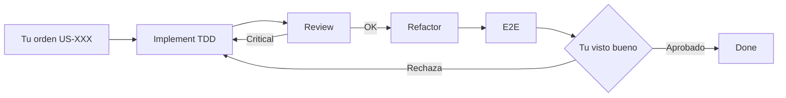

# Workflow — Pipeline por User Story

Desarrollo automatizado por historias: tú ordenas **qué US** codificar; los agentes ejecutan fases con TDD, review, refactor y E2E; **tú das el visto bueno** antes de cerrar.

## Cómo empezar una US

En Cursor, escribe por ejemplo:

```
Implementa US-010
```

El agente (orquestador) leerá `.cursor/skills/us-pipeline/SKILL.md` y ejecutará:

| Fase | Agente | Qué hace |
|------|--------|----------|
| 1 | **Implementer** | TDD: tests rojos → código → verde |
| 2 | **Reviewer** | Audita vs criterios y arquitectura; puede bloquear |
| 3 | **Refactorer** | Limpia sin cambiar comportamiento |
| 4 | **E2E Tester** | Ejecuta tests; pega salida en `04-e2e.md`. Sin ejecución = FAIL/BLOCKED |
| 5 | **Tú** | `Aprobado US-010` o `Rechaza US-010` |

## Comandos de control

| Orden | Efecto |
|-------|--------|
| `Implementa US-010` | Pipeline completo hasta gate humano |
| `Aprobado US-010` | Done en board + issue cerrada |
| `Rechaza US-010` — motivo — fase review | Vuelve a la fase indicada |

## Artefactos

Cada US genera informes en:

```
.cursor/pipeline/US-010/
  00-brief.md
  01-implement.md
  02-review.md
  03-refactor.md
  04-e2e.md
  05-approval.md
```

## Scripts GitHub (board)

```powershell
.\scripts\us_pipeline.ps1 start US-010    # In Progress
.\scripts\us_pipeline.ps1 review US-010   # Review
.\scripts\us_pipeline.ps1 approve US-010    # Done + cierra issue
```

## Dónde está definido cada agente

| Agente | Skill |
|--------|-------|
| Orquestador | `.cursor/skills/us-pipeline/SKILL.md` |
| Implementer | `.cursor/skills/us-implement/SKILL.md` |
| Reviewer | `.cursor/skills/us-review/SKILL.md` |
| Refactorer | `.cursor/skills/us-refactor/SKILL.md` |
| E2E | `.cursor/skills/us-e2e/SKILL.md` |
| Aprobación | `.cursor/skills/us-approval/SKILL.md` |

Índice: `.cursor/AGENTS.md`

## Reglas del repo

- Arquitectura: `.cursor/rules/rpglearn-architecture.mdc`
- Gates (no saltar fases): `.cursor/rules/us-pipeline-gates.mdc`

## E2E: sin ejecución no hay PASS

El agente E2E **debe** correr por ejemplo:

```powershell
.\scripts\run_godot_tests.ps1
```

y pegar la salida en `04-e2e.md`. Marcar PASS solo con **exit code 0**. Si Godot no está disponible en el entorno del agente, el veredicto es **BLOCKED** hasta que alguien ejecute los tests y quede evidencia — no “pendiente local” disfrazado de PASS.

## Diagrama


